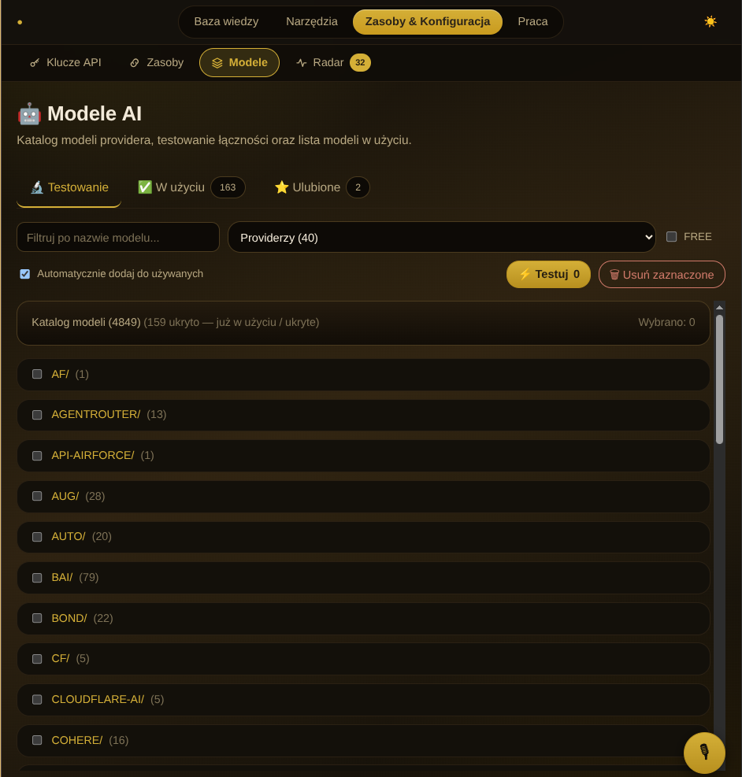

# AUX

Lokalne centrum dowodzenia do pracy z modelami LLM — katalog modeli, playground, biblioteka promptów, dokumenty, vault na klucze, notatki głosowe, monitor dostępności i testy wsadowe. Jeden panel zamiast dziesięciu kart przeglądarki.



## Co to jest

AUX to self-hosted panel dla osób, które pracują z wieloma modelami LLM przez OpenRouter — i opcjonalnie przez lokalny omniroute. Zamiast przełączać się między OpenRouter, playgroundem OpenAI i notatnikiem, masz wszystko w jednym miejscu: katalog modeli z filtrowaniem free/used, bibliotekę promptów, edytor dokumentów z podglądem markdown, vault na klucze API i radar dostępności modeli.

Zbudowany w FastAPI + htmx + Alpine.js. Bez frameworka frontendowego, bez buildu — statyczne CSS-y i JS-y, które rozumie każdy. Cała warstwa danych to `sqlite3` z stdlib Pythona — bez ORM-a, bez migracji, jeden plik bazy.

## Funkcje

| Moduł | Co robi |
|---|---|
| **Models** | Katalog modeli z OpenRouter — filtrowanie free/used, oznaczanie ulubionych, testowanie dostępności |
| **Playground** | Szybkie testy promptów na wybranym modelu, wyniki na żywo przez htmx |
| **Prompts** | Biblioteka promptów z wersjonowaniem i tagami |
| **Optimizer** | Przepisywanie promptów przez model — rola, format, kryteria |
| **Converter** | Konwersja formatów i treści |
| **Translator** | Tłumaczenie promptów i odpowiedzi |
| **Documents** | CRUD z edytorem markdown i podglądem na żywo |
| **Vault** | Zaszyfrowane klucze API — maskowany podgląd, eksport do markdown |
| **Finder** | Wyszukiwanie modeli po nazwie i właściwościach |
| **Radar** | Monitor dostępności modeli — auto-check raz dziennie w tle przy starcie |
| **Voice** | Dyktowanie promptów — lokalny faster-whisper (CPU) albo OpenAI Whisper jako gateway |
| **Workflow** | Łączenie kroków w pipeline |
| **Batch Tester** | Testy wsadowe — wiele promptów × wiele modeli naraz |
| **Projects** | Grupowanie pracy w projekty |
| **Resources** | Zasoby zewnętrzne — linki, dokumentacja, referencje |

## Stack

- **Backend:** FastAPI + `sqlite3` (stdlib, bez ORM) + Jinja2
- **Frontend:** htmx + Alpine.js + własne CSS-y (motyw czerń-złoto)
- **Modele:** OpenRouter API, opcjonalnie lokalny omniroute
- **Voice:** `faster-whisper` lokalnie (CPU, model `base`) — fallback: OpenAI Whisper przez API
- **Auth:** brak — self-hosted, jednoosobowy

## Szybki start

```bash
# 1. Sklonuj
git clone https://github.com/blazejdzirba/aux.git
cd aux

# 2. Wirtualne środowisko
python3 -m venv .venv
source .venv/bin/activate

# 3. Zależności
pip install -r requirements.txt

# 4. (Opcjonalnie) faster-whisper do dyktowania offline
pip install faster-whisper

# 5. Uruchom
uvicorn main:app --reload --port 8000

Wymagania: Python 3.10+, port 8000 wolny. Dla notatek głosowych — faster-whisper (pierwsze uruchomienie dociąga model base, ~150 MB).

Konfiguracja
Klucze API wpisujesz w panelu Vault (szyfrowane, trzymane w lokalnej bazie). Nic nie ląduje w plikach w repo.

Jeśli używasz lokalnego omniroute, endpoint konfigurujesz w Ustawieniach — domyślnie http://localhost:20128/v1. Możesz pracować wyłącznie przez OpenRouter, bez omniroute.

Struktura projektu
text
.
├── main.py                    # wejście FastAPI + lifespan (init DB, radar w tle)
├── config.py                  # ścieżki i konfiguracja
├── database.py                # sqlite3 — połączenie i init
├── models.py                  # schemat i operacje na modelach
├── catalog.py                 # katalog modeli (OpenRouter)
├── radar.py                   # monitor dostępności — refresh_if_stale()
├── finders.py                 # wyszukiwanie (własna baza)
├── project_tree.py            # drzewo projektu
├── scan_contrast.py           # skrypt — skan kontrastu motywu
├── test_plan.sh               # test dymny
├── routers/                   # 15 routerów — jeden na funkcję
│   ├── models_router.py
│   ├── playground_router.py
│   ├── prompts_router.py
│   ├── documents_router.py
│   ├── vault_router.py
│   ├── voice_router.py
│   ├── radar_router.py
│   ├── converter_router.py
│   ├── translator_router.py
│   ├── finder_router.py
│   ├── workflow_router.py
│   ├── projects_router.py
│   ├── resources_router.py
│   ├── settings_router.py
│   └── batch_tester.py
├── services/                  # logika biznesowa
│   ├── catalog_client.py      # OpenRouter API
│   ├── omniroute_client.py    # omniroute API
│   ├── model_monitor.py       # sprawdzanie dostępności modeli
│   ├── prompt_optimizer.py    # optymalizacja promptów
│   ├── converter_service.py   # konwersja
│   ├── voice_service.py       # faster-whisper + OpenAI Whisper fallback
│   └── batch_tester.py        # testy wsadowe
├── templates/                 # Jinja2
└── static/                    # CSS + JS
Motyw
Czerń-złoto. Ciemny color-scheme, akcent złoty, kontrast tekstu sprawdzany skryptem scan_contrast.py. Cache-busting przez ?v= w linkach do CSS — świeży styl po deployu bez przebudowy.

Licencja
MIT — szczegóły w LICENSE.
